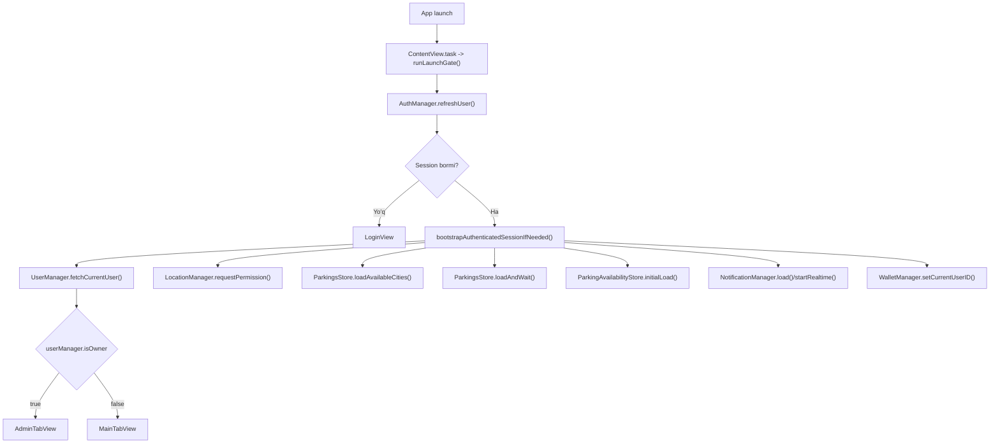
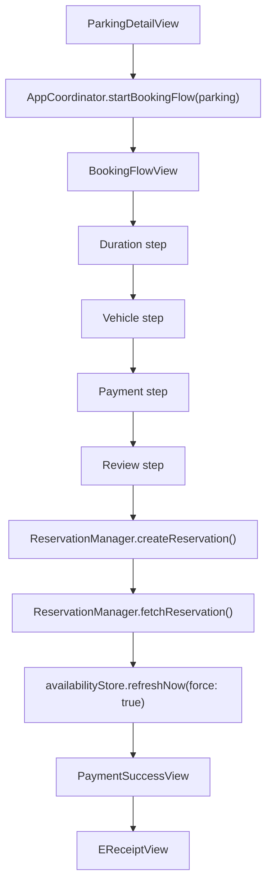
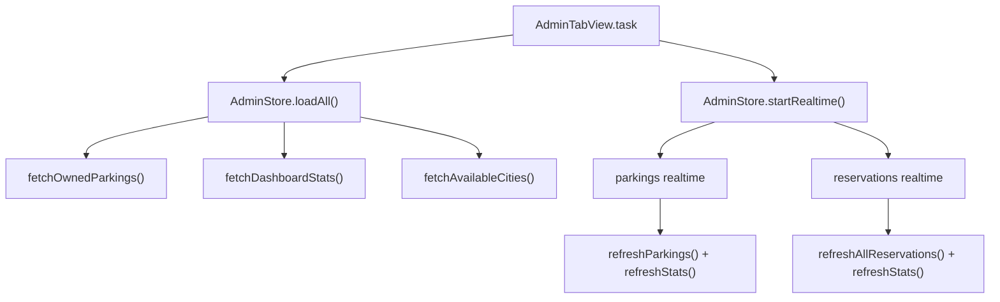
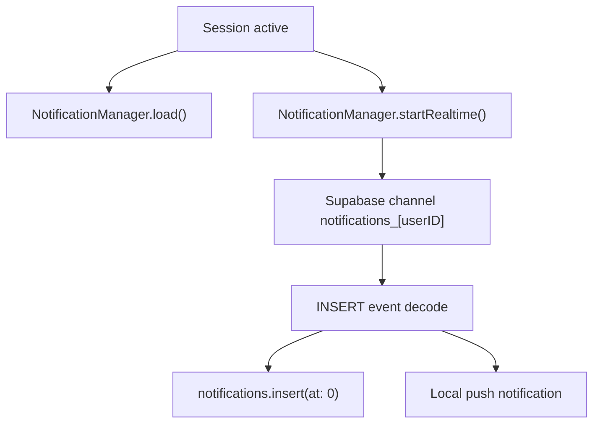

# Smart Parking - Arxitektura Hisoboti

Bu hujjat loyihadagi asosiy komponentlar, state boshqaruvi, backend integratsiyalari va hozirgi kod holatidan ko'rinib turgan risklarni jamlaydi.

## 1. Tizim Qisqacha

`Smart Parking` - SwiftUI asosidagi iOS ilova bo'lib, 2 ta asosiy rolni qo'llab-quvvatlaydi:

- `customer`: parking ko'rish, band qilish, booking tarixini kuzatish, wallet va notification bilan ishlash
- `owner`: parking CRUD, rezervatsiyalarni ko'rish va admin dashboard statistikalarini kuzatish

Texnik stack:

- UI: `SwiftUI`, `Observation`, `ObservableObject`
- Backend: `Supabase Auth`, `PostgREST`, `Realtime`, `Storage`, `RPC`
- Lokal saqlash: `UserDefaults`, fayl cache
- Platform integratsiya: `CoreLocation`, `MapKit`, `UserNotifications`

## 2. Arxitektura Qatlamlari

| Qatlam | Papkalar | Vazifa |
|---|---|---|
| App/Root | `App/`, `Core/Root/`, `Core/Coordinator/` | App entry, session gate, navigation, root flow |
| Feature UI | `Core/Views/`, `Core/Features/` | Customer va owner ekranlari |
| State | `Managers/`, `Storage/`, `ViewModels/` | Session, user, parking, realtime, booking, wallet state |
| Domain/Service | `Services/`, `Core/Users/Services/`, `Core/Features/Auth/Service/` | Supabase query, RPC va storage chaqiruvlari |
| Models | `Models/`, `Core/Users/Models/`, `Core/Features/Booking/` | Codable domain obyektlar |
| Infra/Utils | `Utils/`, `Managers/SB.swift` | Config, localization, theme, logger, client bootstrap |

## 3. Komponent Inventari

### App state va koordinatsiya

| Komponent | Fayl | Turi | Roli |
|---|---|---|---|
| `AuthManager` | `Smart parking/Core/Features/Auth/Manager/AuthManager.swift` | `@Observable @MainActor class` | Session holati, sign in/up/out, password reset |
| `UserManager` | `Smart parking/Core/Users/Managers/UserManager.swift` | `@Observable @MainActor class` | `currentUser`, `isOwner`, profil update |
| `AppCoordinator` | `Smart parking/Core/Coordinator/AppCoordinator.swift` | `@Observable @MainActor singleton` | `NavigationPath`, tab selection, booking full-screen flow |
| `LocalizationManager` | `Smart parking/Utils/LocalizationManager.swift` | `@Observable @MainActor singleton` | Til tanlash va `str(.key)` lookup |
| `AppearanceManager` | `Smart parking/Utils/AppearanceManager.swift` | `@Observable @MainActor singleton` | Light/dark/system mode |

### Backend va domain service qatlamlari

| Komponent | Fayl | Turi | Roli |
|---|---|---|---|
| `SB` | `Smart parking/Managers/SB.swift` | `final class singleton` | `SupabaseClient` bootstrap |
| `SupabaseAuthService` | `Smart parking/Core/Features/Auth/Service/SupabaseAuthService.swift` | `struct` | Auth API va `users` row create |
| `UserService` | `Smart parking/Core/Users/Services/UserServices.swift` | `struct` | `users` table fetch/update |
| `ParkingService` | `Smart parking/Services/ParkingService.swift` | `final class` | City bo'yicha parking fetch, nearby RPC, distinct cities |
| `AdminParkingService` | `Smart parking/Services/AdminParkingService.swift` | `struct` | Owner CRUD, reservations, dashboard stats |
| `ParkingReviewService` | `Smart parking/Services/ParkingReviewService.swift` | `final class` | Review fetch, eligibility, submit |
| `SupabaseStorageManager` | `Smart parking/Storage/SupabaseStorageManager.swift` | `struct` | `avatars/` va `parking-images/` bucket upload |
| `ReservationManager` | `Smart parking/Managers/ReservationManager.swift` | `final class singleton` | `create_reservation`, `cancel_reservation`, reservation fetch |

### Store, manager va realtime qatlamlari

| Komponent | Fayl | Turi | Roli |
|---|---|---|---|
| `ParkingsStore` | `Smart parking/Storage/ParkingsStore.swift` | `@MainActor ObservableObject` | City bo'yicha parking state, cache-first load, nearby, realtime |
| `ParkingAvailabilityStore` | `Smart parking/Storage/ParkingAvailabilityStore.swift` | `@MainActor ObservableObject` | `parking_availability` map, realtime occupancy |
| `AdminStore` | `Smart parking/Storage/AdminStore.swift` | `@Observable @MainActor class` | Owner parkings, stats, reservations, admin realtime |
| `VehiclesStore` | `Smart parking/Storage/VehiclesStore.swift` | `@MainActor ObservableObject singleton` | User vehicles, local cache, optimistic CRUD |
| `FavoritesStore` | `Smart parking/Storage/FavoritesStore.swift` | `@MainActor ObservableObject` | User-scoped favorite parking IDs |
| `ParkingReviewStore` | `Smart parking/Storage/ParkingReviewStore.swift` | `@MainActor ObservableObject` | Review cache, eligibility, submit state |
| `WalletManager` | `Smart parking/Managers/WalletManager.swift` | `@Observable @MainActor singleton` | Balance, transactions, wallet RPCs, local fallback |
| `NotificationManager` | `Smart parking/Managers/NotificationManager.swift` | `@MainActor ObservableObject singleton` | Notification list, unread count, realtime insert handling |
| `LocationManager` | `Smart parking/Managers/LocationManager.swift` | `@MainActor ObservableObject` | Location permission, one-shot location, reverse geocode |
| `ParkingCache` | `Smart parking/Storage/ParkingCache.swift` | `final class singleton` | 5 daqiqalik file cache |
| `BookingsVM` | `Smart parking/ViewModels/BookingsViewModel.swift` | `@MainActor ObservableObject` | User booking list va realtime refresh |

## 4. Environment Injection Zanjiri

```text
Smart_parkingApp
├── @State AuthManager
├── @State UserManager
├── @State LocalizationManager.shared
└── @State AppearanceManager.shared
    └── ContentView
        ├── @Environment AuthManager
        ├── @Environment UserManager
        ├── @Environment LocalizationManager
        ├── @Environment AppearanceManager
        ├── @State AppCoordinator.shared
        ├── @State AdminStore()
        ├── @StateObject ParkingsStore()
        ├── @StateObject ParkingAvailabilityStore(client:)
        ├── @StateObject ParkingReviewStore()
        ├── @StateObject FavoritesStore()
        ├── @StateObject LocationManager()
        └── @StateObject NotificationManager.shared
            ├── owner path -> AdminTabView(store: adminStore)
            └── customer path -> NavigationStack -> MainTabView
                ├── HomeView
                ├── ExploreView
                ├── FavoriteView
                ├── BookingsView(@StateObject BookingsVM)
                └── ProfileView
```

Muhim nuqta:

- `AdminStore` to'g'ri joyda `ContentView` ichida `@State` sifatida yaratilgan
- Customer flow uchun shared store'lar `environmentObject` orqali pastga uzatiladi
- Booking flow `AppCoordinator.fullScreenRoute` orqali ochiladi va `UUID` session bilan identifikatsiya qilinadi

## 5. State Management Qaror Jadvali

| Vaziyat | Ishlatilgan wrapper | Loyihadagi misol |
|---|---|---|
| `@Observable` instance root view ichida yashaydi | `@State` | `ContentView.adminStore`, `Smart_parkingApp.authManager` |
| `@Observable` object environment orqali olinadi | `@Environment` | `AuthManager`, `UserManager`, `AppCoordinator` |
| `ObservableObject` lifecycle viewga tegishli | `@StateObject` | `ParkingsStore`, `BookingsVM`, `LocationManager` |
| `ObservableObject` pastga inject qilinadi | `@EnvironmentObject` | `ParkingsStore`, `ParkingAvailabilityStore`, `FavoritesStore` |
| Simple local UI state | `@State` | `selectedTab`, `showError`, `selectedMinutes` |

## 6. Asosiy Data Flow

### 6.1 App Launch va Auth Flow



### 6.2 Booking Flow



Izoh:

- Hozirgi kodda booking muvaffaqiyatli yaratiladi
- `PaymentMethodsView` faqat `wallet` usulini yoqadi
- Lekin `BookingFlowView.processPayment()` ichida `WalletManager.deduct(...)` chaqirilmaydi

### 6.3 Owner/Admin Flow



### 6.4 Notification va Realtime Flow



## 7. Backend Integratsiya Xarita

### 7.1 Supabase RPC'lar

| RPC | Qayerda ishlatiladi | Maqsad |
|---|---|---|
| `create_reservation` | `ReservationManager` | Booking yaratish |
| `cancel_reservation` | `ReservationManager`, `AdminStore` | Booking bekor qilish |
| `wallet_top_up` | `WalletManager` | Balansni oshirish |
| `wallet_deduct` | `WalletManager` | Balansdan yechish |
| `get_parkings_by_city` | `ParkingService` | City-scoped parking fetch |
| `get_nearby_parkings` | `ParkingService` | Radius bo'yicha yaqin parkinglar |
| `get_distinct_cities` | `AdminParkingService` | Available city list |
| `get_owner_reservations` | `AdminParkingService` | Owner parkings uchun reservationlar |
| `get_owner_dashboard_stats` | `AdminParkingService` | Owner dashboard stats |

### 7.2 Realtime kanallar

| Kanal | Komponent | Jadval | Scope |
|---|---|---|---|
| `parkings:public` | `ParkingsStore` | `parkings` | public changes |
| `realtime:parking_availability` | `ParkingAvailabilityStore` | `parking_availability` | public changes |
| `admin:parkings:<userId>` | `AdminStore` | `parkings` | `owner_id = auth.uid()` filter |
| `admin:reservations:<userId>` | `AdminStore` | `reservations` | hozir filter yo'q |
| `bookings:user` | `BookingsVM` | `reservations` | hozir filter yo'q |
| `notifications_<userID>` | `NotificationManager` | `notifications` | `user_id` filter |

### 7.3 Storage bucket'lar

| Bucket | Manager | Path pattern |
|---|---|---|
| `avatars` | `SupabaseStorageManager` | `<user-id>/avatars/latest.jpg` |
| `parking-images` | `SupabaseStorageManager` | `<city>/<parking-slug>/<uuid>.jpg` |

### 7.4 Muhim jadvallar

| Jadval | Ishlatiladigan komponentlar |
|---|---|
| `users` | `SupabaseAuthService`, `UserService` |
| `parkings` | `ParkingService`, `AdminParkingService`, `ParkingsStore` |
| `reservations` | `ReservationManager`, `BookingsVM`, `AdminStore`, `ParkingReviewService` |
| `parking_availability` | `ParkingAvailabilityStore` |
| `user_wallets` | `WalletManager` |
| `wallet_transactions` | `WalletManager` |
| `user_vehicles` | `VehiclesStore` |
| `parking_reviews` | `ParkingReviewService`, `ParkingReviewStore` |
| `notifications` | `NotificationManager` |

## 8. Test Holati

Joriy test coverage cheklangan:

- `Smart parkingTests/Smart_parkingTests.swift`
  - booking item amount/duration hisoblari
  - favorites user isolation
  - vehicles user isolation
- `Smart parkingUITests/Smart_parkingUITests.swift`
  - default launch test scaffold
  - performance launch scaffold

Hozircha quyidagilar uchun avtomatik test ko'rinmadi:

- auth launch gate
- booking to'lov oqimi
- admin realtime refresh
- wallet RPC integratsiyasi
- review eligibility edge-case'lari

## 9. Kuzatilgan Arxitektura Risklari

### P0

1. `Smart parking/Core/Features/Booking/BookingFlowView.swift`
   Booking yaratiladi, lekin wallet deduction yo'q. UI faqat `wallet` ni tanlashga ruxsat beradi, ammo backend charge oqimi ulanmagan.

### P1

2. `Smart parking/Core/Root/ContentView.swift`
   `bootstrapAuthenticatedSessionIfNeeded()` ichida `availabilityStore.startRealtime()` bor, lekin `parkingsStore.startRealtime()` yo'q. Parking realtime hozir faqat `scenePhase == .active` o'zgarganda ishga tushadi.

3. `Smart parking/ViewModels/BookingsViewModel.swift`
   `bookings:user` realtime subscription `reservations` jadvalini filter'siz tinglaydi. Bu keraksiz reload va bandwith oshishiga olib keladi.

4. `Smart parking/Storage/AdminStore.swift`
   `admin:reservations:<userId>` kanali `reservations` jadvaliga owner-scope filter bermaydi. Hamma reservation o'zgarishlari owner dashboard refresh'ini trigger qilishi mumkin.

### P2

5. `Smart parking/Managers/LocationManager.swift`
   `Unknown`, `Location Off`, `Location Error` kabi state string'lari hardcoded va localization qatlamidan o'tmaydi.

6. `Smart parking/Storage/ParkingCache.swift`
   Cache bitta global faylda saqlanadi. `ParkingsStore` city bo'yicha fetch qilayotgan bo'lsa ham file cache city-scoped emas, shu sabab cache foydasi city switch'da cheklangan.

## 10. Kuchli Tomonlar

- Root state composition toza: auth, user, coordinator va shared managers aniq ajratilgan
- Owner va customer flow'lar `ContentView` darajasida qat'iy bo'lingan
- `AppCoordinator` booking flow uchun session-based `UUID` ishlatadi, bu stale full-screen route muammosini kamaytiradi
- `ParkingsStore` cache-first UX va `ParkingAvailabilityStore` exponential backoff realtime retry ishlatadi
- `VehiclesStore` optimistic update uchun rollback qo'llaydi
- `SupabaseStorageManager` upload uchun MIME va size validation qo'ygan

## 11. Tavsiya Etiladigan Keyingi Qadamlar

1. Booking flow'ga `WalletManager.deduct(...)` va compensation strategy ulash.
2. `ParkingsStore.startRealtime()` ni launch bootstrap ichida ham ishga tushirish.
3. `BookingsVM` va `AdminStore` realtime subscription'larini filter bilan toraytirish.
4. `LocationManager` status matnlarini `AppStrings` orqali lokalizatsiya qilish.
5. Booking, wallet va admin realtime uchun integration test qo'shish.

